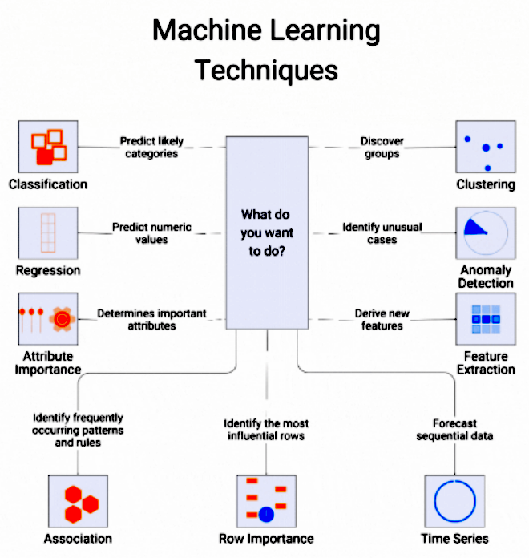

# The ML Problem-Solver's Ultimate Mnemonic Guide

*Your Visual Decision Tree for Machine Learning Success*

## 🎯 The CENTRAL Question Framework



Start every ML project by asking yourself: **"What do you want to do?"** This simple question unlocks the entire decision tree and guides you to the right technique family.

## 📈 The SUPERVISED Learning Path: "I Have Examples"

### Classification: "Which Category?"

**Memory Hook: "PREDICT"**

- **P**redict likely categories
- **R**ecognize patterns in labeled data
- **E**xamine discrete outcomes
- **D**etermine class membership
- **I**dentify which group items belong to
- **C**ategorize new instances
- **T**arget variable is categorical

**Quick Decision Rules:**

- Binary choice (Yes/No, Spam/Not Spam) → Logistic Regression
- Multiple categories → Random Forest or SVM
- Images/Text → Neural Networks
- Need interpretability → Decision Trees


### Regression: "How Much?"

**Memory Hook: "VALUES"**

- **V**alues that are continuous
- **A**mount prediction needed
- **L**inear relationships possible
- **U**nderstanding numeric outcomes
- **E**stimating quantities
- **S**caling numeric predictions

**Quick Decision Rules:**

- Linear trend visible → Linear Regression
- Curved relationships → Polynomial Regression
- Many features → Ridge/Lasso
- Complex interactions → Random Forest Regression


## 🔍 The UNSUPERVISED Learning Path: "I Need to Discover"

### Clustering: "What Groups Exist?"

**Memory Hook: "GROUPS"**

- **G**ather similar items together
- **R**eveal hidden patterns
- **O**rganize unlabeled data
- **U**ncover natural segments
- **P**artition data points
- **S**egment without prior knowledge

**Algorithm Selection:**

- Round clusters → K-Means
- Irregular shapes → DBSCAN
- Don't know cluster count → Hierarchical
- Probability-based → Gaussian Mixture Models


### Anomaly Detection: "What's Unusual?"

**Memory Hook: "OUTLIERS"**

- **O**dd data points
- **U**nusual patterns
- **T**hings that don't fit
- **L**one wolf observations
- **I**rregular behaviors
- **E**xceptions to the norm
- **R**are occurrences
- **S**tatistical deviations


### Feature Extraction: "What's Important?"

**Memory Hook: "REDUCE"**

- **R**educe dimensionality
- **E**xtract key features
- **D**erive new attributes
- **U**ncover hidden variables
- **C**ompress information
- **E**liminate redundancy


## ⚡ The SPECIALIZED Techniques Toolkit

### Association: "What Goes Together?"

**Memory Hook: "BASKET"**

- **B**uy this, buy that patterns
- **A**ssociated item discovery
- **S**hopping cart analysis
- **K**nowledge of co-occurrence
- **E**xploring relationships
- **T**ogether-ness rules

**Classic Applications:**

- Market basket analysis
- Web clickstream analysis
- Protein sequences
- Cross-selling recommendations


### Row Importance: "Which Samples Matter Most?"

**Memory Hook: "INFLUENCE"**

- **I**nfluential data points
- **N**otable observations
- **F**undamental samples
- **L**everaging key instances
- **U**nderstanding data impact
- **E**ssential examples
- **N**otable contributions
- **C**ritical observations
- **E**ffect on model performance


### Time Series: "What Happens Next?"

**Memory Hook: "FUTURE"**

- **F**orecast sequential data
- **U**nderstand temporal patterns
- **T**rend analysis
- **U**pcoming value prediction
- **R**ecurring seasonal patterns
- **E**xtrapolate time-based data

**Algorithm Selection:**

- Clear trend/seasonality → ARIMA/Prophet
- Complex patterns → LSTM/GRU
- Multiple related series → VAR models
- Real-time updates → Online learning


## 🎪 The DECISION CIRCUS: Your 30-Second Guide

```
START: What do you want to do?
│
├─ PREDICT categories → Classification
│  ├─ Need explanation → Logistic Regression
│  ├─ Best performance → XGBoost/Random Forest
│  └─ Images/Text → Neural Networks
│
├─ PREDICT numbers → Regression
│  ├─ Linear relationship → Linear Regression  
│  ├─ Complex patterns → Random Forest
│  └─ Very complex → Neural Networks
│
├─ DISCOVER groups → Clustering
│  ├─ Know group count → K-Means
│  ├─ Unknown groups → Hierarchical
│  └─ Irregular shapes → DBSCAN
│
├─ FIND unusual cases → Anomaly Detection
│  ├─ Statistical approach → Z-score/IQR
│  ├─ Machine learning → Isolation Forest
│  └─ Deep learning → Autoencoders
│
├─ EXTRACT features → Dimensionality Reduction
│  ├─ Visualization → PCA/t-SNE
│  ├─ Feature selection → RFE
│  └─ Compression → Autoencoders
│
├─ FIND patterns → Association Rules
│  └─ Market basket → Apriori/FP-Growth
│
├─ IDENTIFY key data → Row Importance
│  └─ Influential samples → Cook's Distance
│
└─ FORECAST future → Time Series
   ├─ Simple patterns → ARIMA
   ├─ Complex patterns → LSTM
   └─ Multiple variables → VAR
```


## 🚀 The QUICK-START Protocol

### Step 1: Problem Classification (30 seconds)

Ask these questions in order:

1. **Do I have a target variable?**
    - Yes → Supervised Learning
    - No → Unsupervised Learning
2. **Is my target categorical or numeric?**
    - Categorical → Classification
    - Numeric → Regression
3. **Is my data sequential/time-based?**
    - Yes → Time Series
    - No → Continue with above logic

### Step 2: Algorithm Selection (60 seconds)

Use the **"START SIMPLE"** rule:

- **S**tart with baseline (Linear/Logistic Regression)
- **T**est robust middle-ground (Random Forest)
- **A**dvanced if needed (XGBoost/Neural Networks)
- **R**epeat with best performer
- **T**une hyperparameters


### Step 3: Validation Strategy (30 seconds)

**Memory Hook: "SPLIT"**

- **S**eparate train/validation/test
- **P**erform cross-validation
- **L**ook at multiple metrics
- **I**terate based on results
- **T**est on unseen data


## 🎨 Visual Problem-Solving Patterns

### The Icon System

- **🔍 Magnifying Glass** (Classification) → Looking for categories
- **📈 Graph** (Regression) → Predicting trend lines
- **👥 People Groups** (Clustering) → Finding natural groups
- **⚠️ Warning Sign** (Anomaly Detection) → Spotting unusual cases
- **🔧 Tools** (Feature Extraction) → Building better features
- **🛒 Shopping Cart** (Association) → Items that go together
- **⭐ Star** (Row Importance) → Highlighting key samples
- **⏰ Clock** (Time Series) → Predicting the future


### The Color-Coded Workflow

- **Red/Orange**: Supervised Learning (I have answers)
- **Blue/Purple**: Unsupervised Learning (I need to discover)
- **Green**: Specialized techniques (Specific use cases)


## 💡 Pro Tips \& Golden Rules

### The "ALWAYS" Checklist

- **A**lways start with data exploration
- **L**ook for missing values and outliers
- **W**atch for data leakage
- **A**pply feature scaling when needed
- **Y**et remember: simple first, complex later
- **S**ave time for proper validation


### The "NEVER FORGET" Rules

1. **Garbage in, garbage out** - Data quality beats algorithm complexity
2. **Cross-validate everything** - Single splits lie
3. **Business context matters** - Perfect accuracy might not be the goal
4. **Monitor model performance** - Models decay over time
5. **Document your decisions** - Future you will thank present you

### Emergency Algorithm Selection

**When in doubt, try this sequence:**

1. **Regression problems:** Linear → Random Forest → XGBoost
2. **Classification problems:** Logistic → Random Forest → XGBoost
3. **Clustering problems:** K-Means → Hierarchical → DBSCAN
4. **Time series problems:** Simple average → ARIMA → LSTM

This mnemonic guide transforms the complex ML landscape into memorable, actionable decision patterns. Keep this as your go-to reference, and you'll never be lost in the machine learning maze again!
