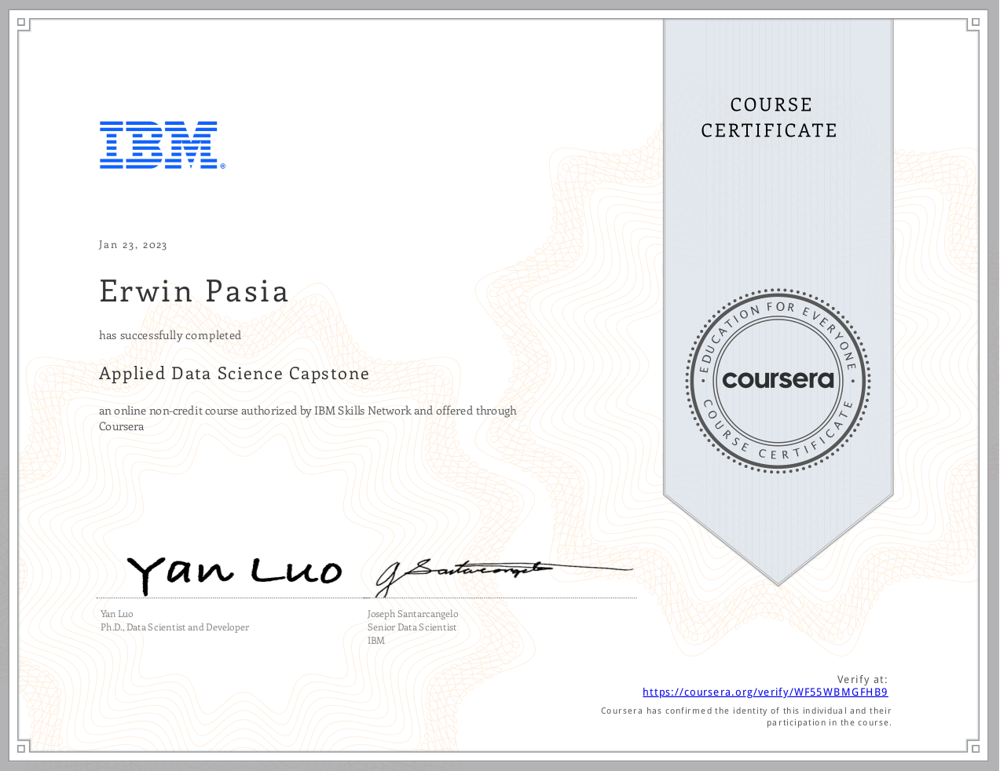

# [IBM Data Science Professional Certificate's Capstone Project](https://www.coursera.org/verify/WF55WBMGFHB9) - COMPLETED!

The IBM Data Science Professional Certificate's Capstone Project serves as a comprehensive application of the skills acquired throughout the program. This project is designed to simulate a real-world data science task, where students take on the role of a data scientist working for a startup aiming to compete with SpaceX. The primary objective is to predict whether the first stage of SpaceX's Falcon 9 rocket will land successfully, which is crucial for reducing launch costs and making informed bidding decisions against SpaceX.

**Project Overview**

**Objective**

The capstone project focuses on applying data science methodologies to predict the success of the Falcon 9 rocket's first stage landing. The successful completion of this project allows students to demonstrate their proficiency in data science and machine learning, adding a significant project to their professional portfolio.

**Data Science Methodology**

The project involves several key steps that mirror the typical workflow of a data scientist:

- **Data Collection:** Students gather data using APIs and web scraping techniques. The SpaceX API is commonly used to collect historical launch data.

- **Data Wrangling:** Using tools like Pandas and NumPy, students preprocess the collected data to clean and structure it for analysis.

- **Exploratory Data Analysis (EDA):** Students perform EDA using visualization libraries such as Matplotlib and Seaborn to uncover patterns and insights within the data.

- **Feature Engineering:** This involves selecting and transforming variables that will be used in predictive models.

- **Machine Learning Model Development:** Students build predictive models using various machine learning algorithms, such as Random Forest and Logistic Regression, to forecast the landing success of Falcon 9.

- **Model Evaluation:** The performance of these models is assessed using appropriate metrics like classification accuracy.

- **Reporting:** Finally, students compile their findings into a business case report intended for stakeholders, showcasing how these insights can inform strategic decisions.

**Tools and Techniques**

- **Programming Languages:** Python is primarily used for scripting and analysis.

- **Libraries:** Key libraries include Pandas, NumPy, Matplotlib, Seaborn, and Scikit-learn for machine learning.

- **Data Sources:** SpaceX API for real-time data collection; web scraping tools like Beautiful Soup are also utilized.

**Outcome**

By completing this capstone project, students gain hands-on experience with real-world datasets and enhance their problem-solving skills. They learn how to apply theoretical knowledge in practical scenarios, making them better prepared for careers in data science. Additionally, they produce a tangible project that can be showcased to potential employers as part of their professional portfolio.

This capstone not only reinforces technical skills but also emphasizes critical thinking and effective communication of results to non-technical stakeholders, which are essential competencies in the field of data science.

## [Certificate Of Competency:](https://www.coursera.org/verify/WF55WBMGFHB9)

    

